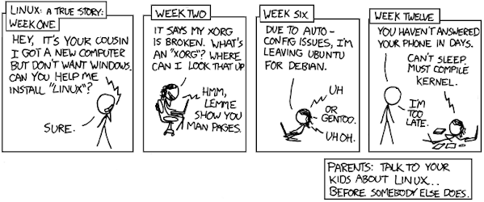
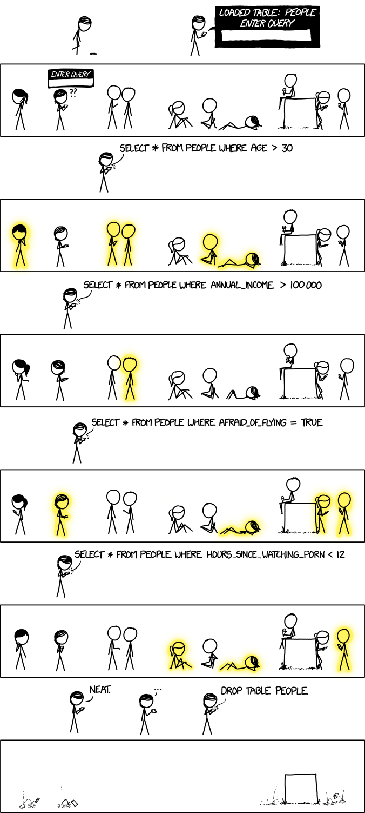
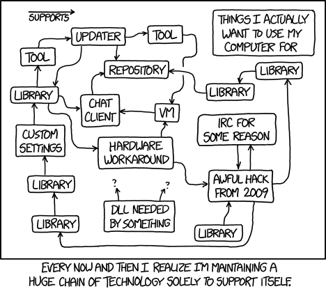
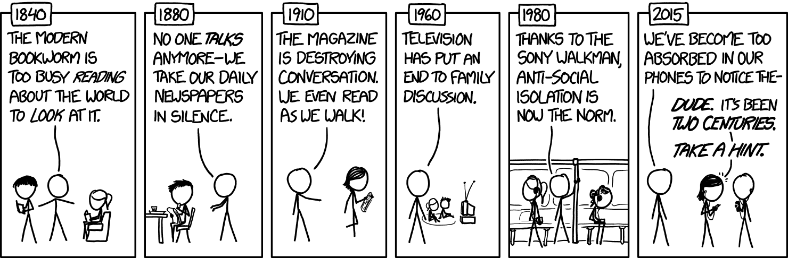

# The Guide

## NOW

### OS Theory

[Computer Hardware and Operating Systems](https://www.edx.org/course/computer-hardware-and-operating-systems)

[Introduction to Operating System](https://www.classcentral.com/course/udacity-introduction-to-operating-systems-3419)

#### Unix survival skills:

[Advanced Unix Commands](https://www.udemy.com/course/advance-unix-commands/)
[Advance Unix File Processing](https://www.udemy.com/course/advance-unix-file-processing/)

## NEXT

1. How do containers work?:
Once those OS & computer architecture concepts solidify in your mind, you will find this series on container internals useful:
[Link](https://medium.com/@saschagrunert/demystifying-containers-part-i-kernel-space-2c53d6979504)

2. Kubernetes 101:
This is an internal training for Kubernetes

3. Network programming with Go:
4. 
[Go](https://ipfs.io/ipfs/QmfYeDhGH9bZzihBUDEQbCbTc5k5FZKURMUoUvfmc27BwL/index.html)

4. OS Theory ++:

[OS Theory](https://www.classcentral.com/course/udacity-gt-refresher-advanced-os-4734)

[Advanced Operating Systems](https://www.classcentral.com/course/udacity-advanced-operating-systems-1016)

Lessons **6** & **8** may appear difficult to understand, and hence be patient with yourself and can also be ignored safely.

## LATER

1. Some SQL play (when ActiveRecord generates mysterious SQL):

[Link](https://www.udemy.com/course/master-sql-for-data-science/)

2. Next level SQL (optional):

[Link](https://www.udemy.com/course/advanced-sql-mysql-for-analytics-business-intelligence/)

# Books

### First things first!

> *"Clean code is not written by following a set of rules. You don’t become a software craftsman by learning a list of heuristics. Professionalism and craftsmanship come from values that drive disciplines.”* — Clean Code: A Handbook of Agile Software Craftsmanship

> *"One hundred years from now, our engineering may seem as archaic as the techniques used by medieval cathedral builders seem to today's civil engineers, while our craftsmanship will still be honored"* - Andrew Hunt, The Pragmatic Programmer

The best practices books:
- [The Pragmatic Programmer: From Journeyman to Master](https://www.goodreads.com/book/show/4099.The_Pragmatic_Programmer)
- [Clean Code](https://www.goodreads.com/book/show/3735293-clean-code)

### Programming Languages

Good references for various programming languages
- [The C Programming Language](https://www.goodreads.com/book/show/515601.The_C_Programming_Language)
- [The C++ Programming Language (4th Edition)](https://www.stroustrup.com/4th.html)
- [Dive Into Python 3](https://diveintopython3.problemsolving.io/)
- [Ruby](https://www.oreilly.com/library/view/the-ruby-programming/9780596516178/)
- [Go](https://www.gopl.io/)

### Good Reads

From [Leslie Lamport](https://en.wikipedia.org/wiki/Leslie_Lamport)
Leslie Lamport in an interview about "Blueprint" of software (specification)
- [Link](https://www.wired.com/2013/01/code-bugs-programming-why-we-need-specs/)
- [Link](http://lamport.azurewebsites.net/pubs/pubs.html)

Scalable Network Programming (The Quest For A Good Web Server)
 - http://bulk.fefe.de/scalable-networking.pdf

## Welcome to Amagi

> Thanks for enjoying these cartoons from https://xkcd.com/. We wish you have learned valuable lessons. Lastly, thanks for visiting this page.
{.is-success}

# Credits

https://xkcd.com/
